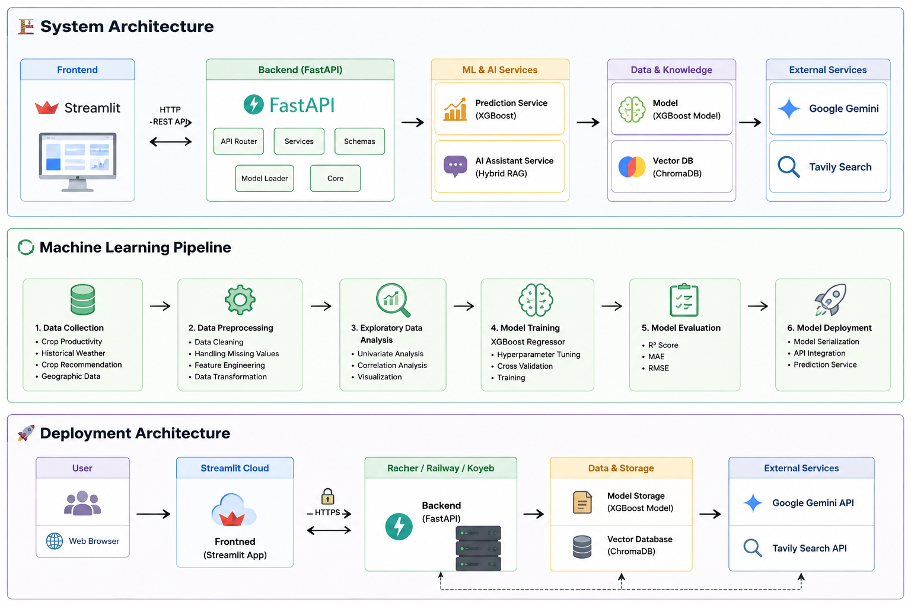

<div align="center">

# 🌱 Menanam AI

### AI-Powered Smart Agriculture Decision Support System

An intelligent agricultural assistant that combines **Machine Learning**, **Hybrid Retrieval-Augmented Generation (Hybrid RAG)**, and **Large Language Models (LLMs)** to help farmers estimate crop productivity and access reliable agricultural knowledge.

<p>


</p>

</div>

---

# 📖 Overview

**Menanam AI** is an AI-powered decision support system designed to support modern agriculture by combining predictive analytics and generative AI.

The application enables users to:

- 🌾 Predict crop productivity using Machine Learning.
- 🤖 Ask agricultural questions through an AI Assistant powered by Hybrid RAG.
- 📍 Explore historical weather information interactively.
- 📚 Retrieve trusted agricultural knowledge from a semantic knowledge base.

---

# ✨ Key Features

| Feature | Description |
|----------|-------------|
| 🌾 Productivity Prediction | Predict crop productivity using historical weather data |
| ☁️ Historical Weather | Display historical weather information for selected districts |
| 📍 Interactive Map | Select districts directly from an interactive map |
| 🤖 AI Assistant | Agricultural chatbot powered by Google Gemini |
| 📚 Knowledge Base | Semantic search using Chroma Vector Database |
| 🌐 Internet Search | Tavily fallback when local knowledge is insufficient |

---

# 🏗 System Structure

<p align="center">



</p>

---

# 📂 Project Structure

```text
Menanam_AI/
│
├── app/                        # FastAPI Backend
│   ├── api/
│   ├── core/
│   ├── schemas/
│   ├── services/
│   └── main.py
│
├── frontend/                   # Streamlit Frontend
│   ├── pages/
│   ├── components/
│   ├── services/
│   ├── utils/
│   ├── assets/
│   ├── Home.py
│   └── config.py
│
├── data/
│   ├── raw/
│   ├── primary/
│   └── intermediate/
│
├── models/
├── vector_db/
├── knowledge_base/
├── knowledge_base_clean/
├── process/
├── scripts/
├── docs/
│
├── requirements.txt
├── README.md
└── .gitignore
```

---

# ⚙️ Technology Stack

## Machine Learning

- XGBoost
- Scikit-Learn
- Pandas
- NumPy

## Backend

- FastAPI
- Uvicorn
- Pydantic

## Frontend

- Streamlit
- Folium
- Streamlit-Folium

## Hybrid RAG

- LangChain
- ChromaDB
- HuggingFace Embeddings
- Google Gemini
- Tavily Search

---

# 📊 Dataset

This project integrates multiple datasets:

- Crop Productivity Dataset
- Historical Weather Dataset
- Crop Recommendation Dataset
- Geographic Coordinates Dataset
- Agricultural Knowledge Base

---

# 📷 Application Preview

## 🏠 Home


---

## 🌾 Productivity Prediction


---

## 🤖 AI Assistant


---

# 🚀 Getting Started

## 1. Clone Repository

```bash
git clone https://github.com/hilmiaji28/Menanam_AI.git

cd Menanam_AI
```

---

## 2. Install Dependencies

```bash
pip install -r requirements.txt
```

---

## 3. Create Environment Variables

Create a `.env` file.

```env
GOOGLE_API_KEY=YOUR_GOOGLE_API_KEY

TAVILY_API_KEY=YOUR_TAVILY_API_KEY
```

---

## 4. Run FastAPI Backend

```bash
uvicorn app.main:app --reload
```

Backend URL

```
http://localhost:8000
```

---

## 5. Run Streamlit Frontend

```bash
streamlit run frontend/Home.py
```

Frontend URL

```
http://localhost:8501
```

---

# 📈 Model Performance

| Model | Metric |
|--------|--------|
| XGBoost Regressor | R² ≈ 0.80 |
| Mean Absolute Error | ~26 |
| Root Mean Squared Error | ~45 |

---

# 🔮 Future Work

- Crop Recommendation System
- Real-time Weather API Integration
- Satellite Imagery Analysis (NDVI)
- Pest & Disease Detection
- User Authentication
- Cloud Deployment
- Mobile Application

---

# 📚 Documentation

Detailed documentation is available in the `docs/` directory.

- System Architecture
- Machine Learning Pipeline
- Deployment Architecture

---

# 👨‍💻 Author

**Hilmi Aji**

Bachelor of Agricultural Engineering

Institut Teknologi Bandung (ITB)

AI Engineer | Machine Learning | Business Analytics

- GitHub: https://github.com/hilmiaji28
- LinkedIn: *(Add your LinkedIn URL here)*

---

# ⭐ Support

If you find this project useful, please consider giving it a **⭐ Star** on GitHub.

It helps others discover the project and supports future development.

---

<div align="center">