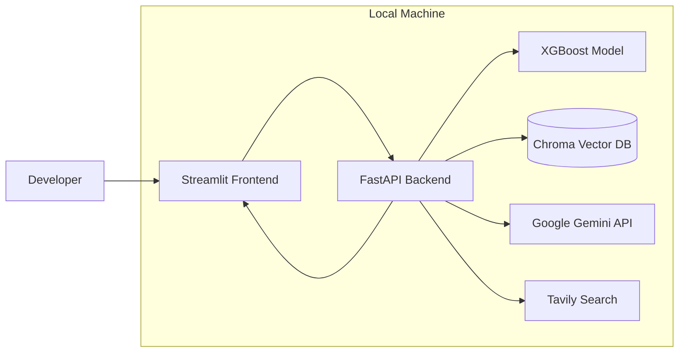

# Deployment Architecture

## Local Deployment



---

## Local Development Workflow

```text
Terminal 1

uvicorn app.main:app --reload

↓

FastAPI Backend
http://localhost:8000


Terminal 2

streamlit run frontend/Home.py

↓

Streamlit Frontend
http://localhost:8501
```

---

## Deployment Components

| Component | Technology |
|-----------|------------|
| Frontend | Streamlit |
| Backend | FastAPI |
| Machine Learning | XGBoost |
| Vector Database | ChromaDB |
| LLM | Google Gemini |
| Internet Search | Tavily Search |
| Runtime | Local Machine |